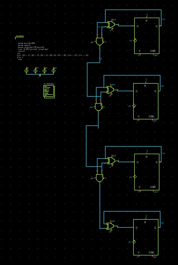
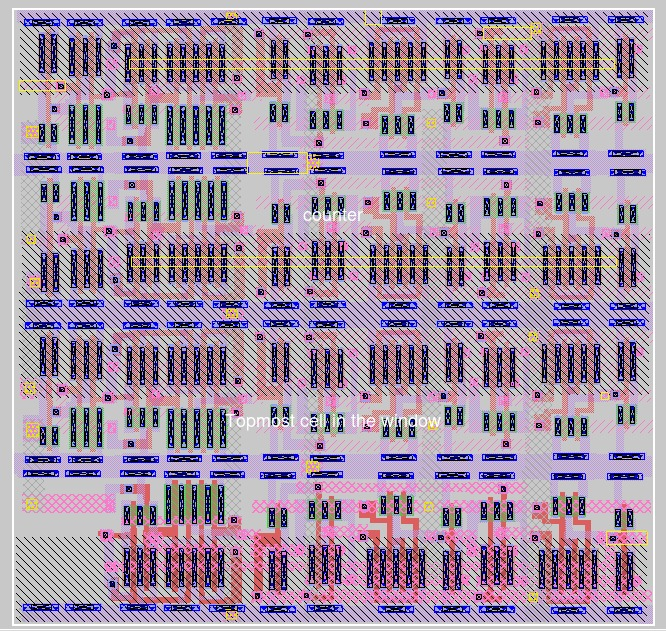
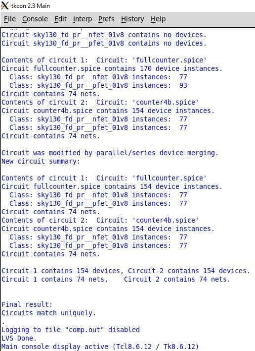

# EAMTA 2024 - Track VLSI basico

Este repositorio pertenece al trabajo final del track [`VLSI basico`](https://eamta.ar/basic-vlsi/) en la Escuela Argentina de Micro Nanoelectrónica, Tecnologı́a y Aplicaciones [`EAMTA`](https://eamta.ar/) 2024.

## Integrantes:
- Avila Jesus
- Canosa Ailen
- Gutierrez Emiliano
- Valenzuela Alejo

## Proyecto: 
Como proyecto final del curso, se propone realizar un contador de 4 bits con los siguientes pasos: 
- Diseño de esquematico. 
- Diseño del layout.
- Verificacion de matcheo de ambas instancias.

En caso de querer revisar los esquematicos individuales, estos se encuentran en las carpetas:
- Compuertas.tar.gz
- sch (carpeta de esquematicos)
- mag (carpeta de layouts)
- xschemCounter (carpeta de contador de 4 bits)

A continuacion, se muestran los resultados de las 3 instancias de desarrollo **para el contador de 4 bits**.

### 1. Diseño de esquematico

Se utilizo la herramienta [`xschem`](https://xschem.sourceforge.io/stefan/index.html) para el desarrollo del esquematico.

### 2. Diseño del layout

Se utilizo la herramienta [`magic`](http://opencircuitdesign.com/magic/) para el desarrollo del layout.

### 3. Verificacion de matcheo de ambas instancias

Se utilizo la herramienta [`netgen`](http://opencircuitdesign.com/netgen/) para la verificacion del match entre netlists de esquematico y layout.

